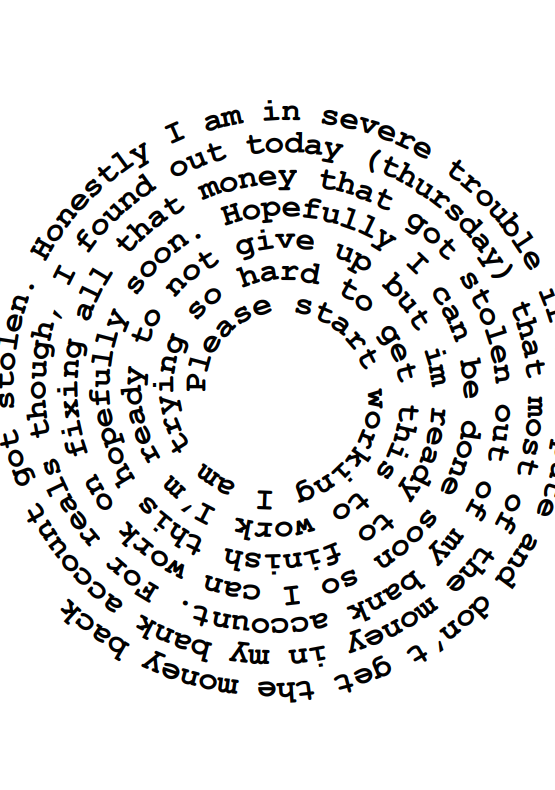

# SpiralPDF

This is a wrapper class for HaruPDF that creates PDFs that contain inputted text in Spirals. 

To use this class you need to download and make the HaruPDF source code.

## Example Output

Given some text and a description of how the spiral should be created, here is an output of the resulting PDF:

